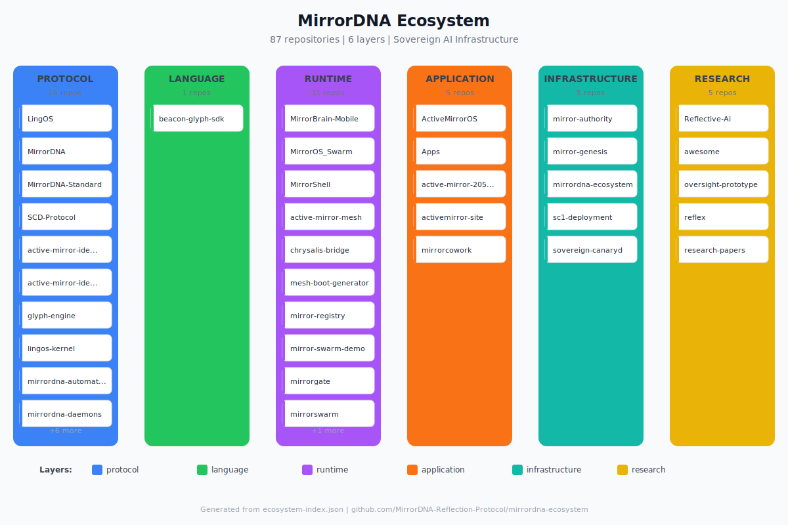

# MirrorDNA Ecosystem

> The operating system for your AI to remember who you are — on your terms.

[](LICENSE)
[](ecosystem-index.json)
[](SPEC.md)



## The Problem

Every AI company wants to own your context. They call it "memory" but it's surveillance with a friendly face. Your conversations, preferences, and patterns — stored on their servers, used for their training, deleted when they decide.

## The Alternative

MirrorDNA is sovereign AI infrastructure. Your memory. Your hardware. Your rules.

**87 repositories. 7 live products. 15+ services. Built by one person in 8 months.**

## Start Here

**[QUICKSTART.md](QUICKSTART.md)** — Get running in 60 seconds.

## What's Inside

```
┌─────────────────────────────────────────────────────────────────┐
│                    MIRRORDNA ECOSYSTEM                          │
├─────────────────────────────────────────────────────────────────┤
│  PROTOCOL      │ MirrorDNA, SCD-Protocol, LingOS, Glyph Engine  │
│  (core specs)  │ Zero-knowledge memory, constitutional anchors  │
├────────────────┼────────────────────────────────────────────────┤
│  LANGUAGE      │ lingos-kernel, beacon-glyph-sdk                │
│  (semantics)   │ Ontology and semantic scaffolding              │
├────────────────┼────────────────────────────────────────────────┤
│  RUNTIME       │ MirrorBrain, MirrorGate, mirrordna-mcp         │
│  (execution)   │ Orchestration, inference control, 80+ tools    │
├────────────────┼────────────────────────────────────────────────┤
│  APPLICATION   │ activemirror-site, MirrorBrain-Mobile          │
│  (products)    │ User-facing tools and interfaces               │
├────────────────┼────────────────────────────────────────────────┤
│  INFRA         │ sc1-deployment, chrysalis-bridge, canaryd      │
│  (deployment)  │ CI/CD, mesh networking, monitoring             │
├────────────────┼────────────────────────────────────────────────┤
│  RESEARCH      │ research-papers, llm-optimizer, oversight      │
│  (experiments) │ Published papers, exploratory work             │
└────────────────┴────────────────────────────────────────────────┘
```

## The Story

This started with one question: *"What if AI could remember me — on my terms?"*

Nine months. Under $10,000. One person in Goa with AI twins.

**[Read the full story →](STORY.md)**

## Published Research

- **SCD Protocol v3.1** — Structured Contextual Distillation
  DOI: [10.5281/zenodo.17787619](https://doi.org/10.5281/zenodo.17787619)
- **Governance and Boundary Conditions for Reflective AI Systems**
- **Layered Governance for Large Language Model Systems**

## Explore the Ecosystem

- **[ecosystem-index.json](ecosystem-index.json)** — Machine-readable index of all 87 repos
- **[SPEC.md](SPEC.md)** — Full technical specification
- **[templates/](templates/)** — Metadata templates for ecosystem compliance

## Live Products

| Product | URL | Purpose |
|---------|-----|---------|
| Active Mirror | [activemirror.ai](https://activemirror.ai) | Main site + sovereign inference demo |
| Mirror Seed | [id.activemirror.ai](https://id.activemirror.ai) | Portable AI identity (134+ seeds) |
| Truth Engine | [brief.activemirror.ai](https://brief.activemirror.ai) | Decisions, Forecasts, War Room |
| Proof-of-Memory | [activemirror.ai/proof](https://activemirror.ai/proof) | Cryptographic attestation |

## Key Differentiators

| Feature | MirrorDNA | LangChain Memory | Mem0 |
|---------|-----------|------------------|------|
| Data location | Your hardware | Their cloud | Their cloud |
| Memory ownership | You | Shared | Shared |
| Memory decay | Built-in | No | No |
| Consent model | Explicit | Implicit | Implicit |
| Governance layer | Structural | None | None |
| Open source | 60 public repos | Partial | Partial |

## Contributing

This ecosystem is primarily solo-maintained. If you want to contribute:

1. Read [SPEC.md](SPEC.md) for metadata requirements
2. Use [templates/metadata.yml.template](templates/metadata.yml.template) for new repos
3. Run `python scripts/validate-metadata.py` before PRs

## License

MIT — see [LICENSE](LICENSE)

---

*"The protocol is the sovereignty. The infrastructure is the proof."*

**MirrorDNA-ID:** ECOSYSTEM-INDEX-20260129
**Author:** Paul Desai
**Organization:** N1 Intelligence (OPC) Pvt Ltd
